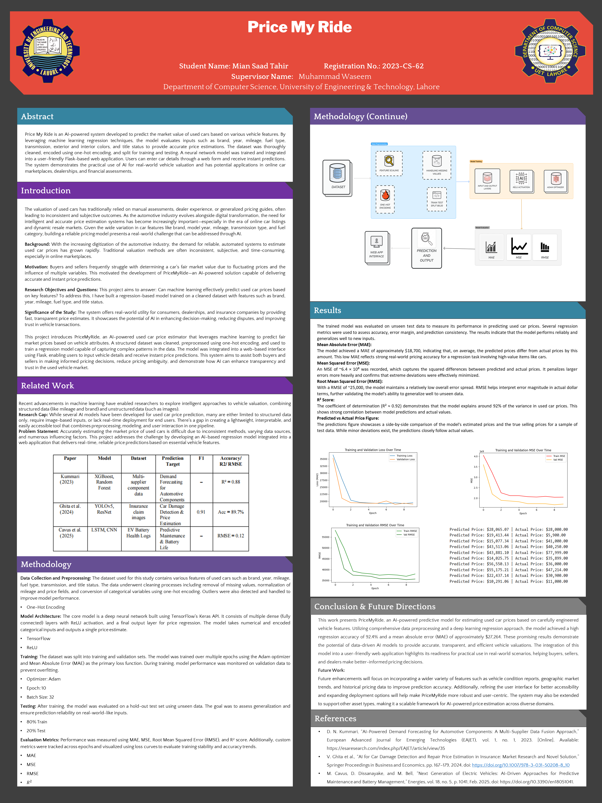
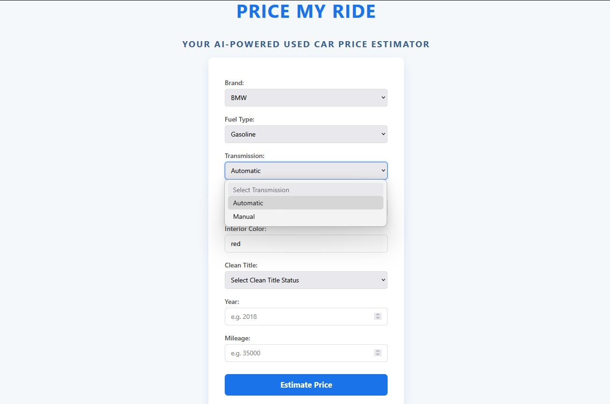

# Price My Ride

An AI-powered used car price prediction system built using a deep learning model. It estimates the market price of used cars based on various features such as mileage, fuel type, brand, transmission, and condition. The project uses a fully cleaned and preprocessed dataset and is implemented using TensorFlow and Scikit-learn. This research project also includes a formal **IEEE-style research paper** that discusses the methodology, model architecture, evaluation metrics, results and conclusions in detail.

## Table of Contents
- [Features](#features)
- [Model Architecture](#model-architecture)
- [Poster](#poster)
- [Screenshots](#screenshots)
- [Usage](#usage)
- [Technologies Used](#technologies-used)
- [Research Paper](#research-paper)
- [Contributing](#contributing)

## Features
- **Data Cleaning & Preprocessing**: Cleaned columns such as `milage`, `price`, and handled missing values.
- **Label Encoding**: Converted categorical variables to numerical format for model training.
- **Model Architecture**: Deep Neural Network (DNN) with three hidden layers using ReLU activation.
- **Evaluation Metrics**: Included RMSE and R² metrics using Keras backend for better evaluation.
- **Visualizations**: Tracked and plotted training loss, MAE, MSE, and RMSE over epochs.
- **Model Saving**: Final model exported as `used_car_price_model.keras`.

## Model Architecture
- **Input Layer**: Accepts features such as mileage, fuel type, transmission, etc.
- **Hidden Layers**:
  - Dense(128, ReLU)
  - Dense(64, ReLU)
  - Dense(32, ReLU)
- **Output Layer**: Dense(1) for regression output
- **Optimizer**: Adam  
- **Loss Function**: Mean Absolute Error (MAE)  
- **Metrics**: MAE, MSE, RMSE, R²

## Poster

## Screenshots

- [Usage](#usage)
